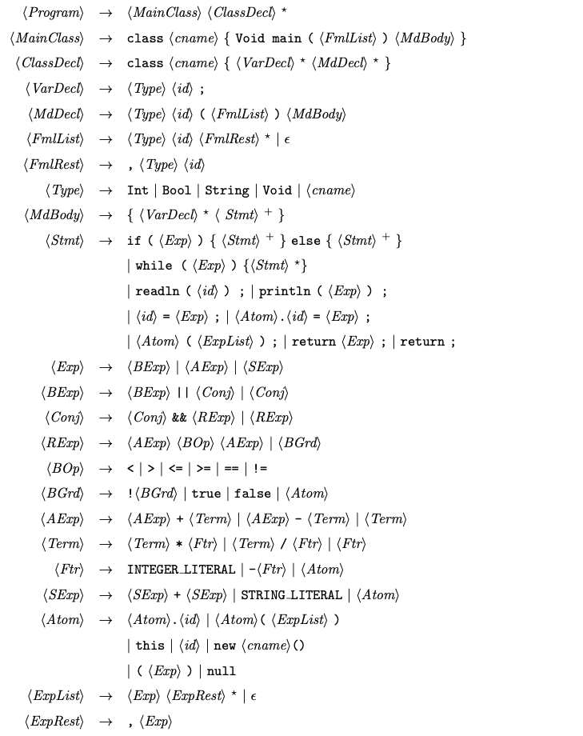

# Jlitec

A compiler for the language jlite. Built as the assignments for CS4212 in NUS.


## Usage

Build the project with:
```shell script
make
```
Run the built program with:
```shell script
make run ARGS="[-O] <input-file>" [OUT=<output-file>]
```
`-O` is optional here. Specifying it would turn on the major optimizations.

`OUT=<output-file>` is optional here. if it is not specified, output is written to `stdout`.

To clean the build, run:
```shell script
make clean
```


## Language specification

The jlite language specification is as follows:




## Dataflow analysis

A generic dataflow analysis engine is implemented in the class `analysis.DataflowAnalyzer`. 
This is a generic framework. To instantiate a dataflow analysis instance, 
one just need to supply several parameters such as the transfer function etc.

With the help of a generic dataflow analyzer, several instances are instantiated and they are 
used for register allocation and optimizations. These dataflow instances are:

- `analysis.LivenessAnalyzer`
- `analysis.ReachingDefAnalyzer` (implemented although not currently being used)
- `analysis.CopyPropAnalyzer`
- `analysis.AvailableExpAnalyzer`

The analyzers work on the granularity of statements level (instead of basic blocks level). 
Dataflow values at entry and exit of basic blocks are also automatically captured in the 
statements level data values. This choice is more practical, since the final dataflow values 
at statements level are useful in register allocation and optimizations.


## Register allocation

Chaitin's graph coloring algorithm is implemented for register allocation, and the main logic 
is in `codegen.RegAllocator`.

In each allocation round, a `LivenessAnalyzer` is instantiated to perform liveness analysis on 
the CFG. The interference graph is built for the liveness information obtained from liveness 
analysis, and graph coloring is subsequently performed.

In cases when a spill is needed, the node with highest degree among the never-spilled-before node 
is chosen as the spill candidate. If there are any spills during coloring, all the def and use of 
spilled vars in the code are instrumented with `store` and `load`. After that, a new allocation 
round is run again for the updated code and CFG.


## Stack management

Normal stack management is implemented. Apart from `pc`, `lr` and the callee-saved registers, 
stack space is reserved for each spilled variable and also for extra arguments of method calls. 
If there is a method call made, and it has more than 4 arguments, the extra arguments are stored on 
the stack of the caller, so the caller needs to reserve space in its stack frame.


## Major optimizations

The major optimizations can be turned on with `-O` option before supplying the input file name.

Three main optimizations implemented are common subexpression elimination, copy propagation and 
deadcode elimination. Since they work hand-in-hand, they are executed in sequence and for 
several rounds (until no more optimizations can be made). The optimization can be found in 
class `codegen.IrOptimizer`. This class invokes different dataflow analyzers and perform the 
optimizations in rounds.

### Common subexpression elimination

CSE is implemented on top of the `AvailableExpAnalyzer`, which computes the available expressions 
at each program point.

Only RHS of assignment statements are considered in CSE here, since they are the most significant 
for subsequent optimizations. Also, for simplicity, if a common subexpression comes from more than 
one predecessor nodes, this case is not optimized since it requires assigning them to same variable 
in all the predecessor nodes.

### Copy propagation

Copy propagation is implemented on top of the `CopyPropAnalyzer`, which computes the `Copy` 
available at each program point. (A `Copy` consists of a statement like `x = y`.) The `Copy`s are 
used to check whether some variables in the current statement can be replaced.

### Deadcode elimination

DCE is implemented on top of the `LivenessAnalyzer`. We only care about assignment statements here. 
If the LHS variable of assignment is not live immediately after this assignment, this assignment 
is deadcode and we eliminate it.

### Example

To demonstrate the power of the main optimizations, consider the following jlite program:

```
class Main {
    Void main() {
        Int a;
        Int b;
        Int c;
        Int d;
        Int e;
        Int f;
        Int g;

        a = 2 + 3; // 5
        b = 10; // 10
        c = a; // 5
        d = a + b; // 15
        e = d; // 15
        d = 2 + 3; // 5
        f = e; // 15
        g = c + d; // 10

        println(g); // should print 10
    }
}
```

When optimizations are turned off, the IR for `main` is:

```
Void main(Main this){
    Int a;
    Int b;
    Int c;
    Int d;
    Int e;
    Int f;
    Int g;
    Int _t0 = 2 + 3;
    a = _t0;
    b = 10;
    c = a;
    Int _t1 = a + b;
    d = _t1;
    e = d;
    Int _t2 = 2 + 3;
    d = _t2;
    f = e;
    Int _t3 = c + d;
    g = _t3;
    println(g);
}
```

and the non-optimized ARM code is:

```
main:
push {fp,lr,r5,r6,r4}
add fp,sp,#16
sub sp,fp,#16
mov r4,#5
mov r5,r4
mov r4,#10
mov r6,r5
add r4,r5,r4
mov r4,r4
mov r5,r4
mov r4,#5
mov r4,r4
add r4,r6,r4
mov r4,r4
ldr r0,=L1
mov r1,r4
bl printf(PLT)

.M1exit:
sub sp,fp,#16
pop {fp,pc,r5,r6,r4}
```

If the three optimizations are turned on, the optimized IR would be:

```
Void main(Main this){
    Int a;
    Int b;
    Int c;
    Int d;
    Int e;
    Int f;
    Int g;
    Int _t0 = 2 + 3;
    Int _t3 = _t0 + _t0;
    println(_t3);
}
```

and the generated ARM code is simply:

```
main:
push {fp,lr,r4}
add fp,sp,#8
sub sp,fp,#8
mov r4,#5
add r4,r4,r4
ldr r0,=L1
mov r1,r4
bl printf(PLT)

.M1exit:
sub sp,fp,#8
pop {fp,pc,r4}
```


## Minor optimizations

This compiler also implements simple constant folding, and this is implemented as details in 
the `codegen.MethodGen` class, instead of as separate passes (simple constant folding is always 
applied).

Example of this would be when `a = 1 + 2` is present, it will be optimized into `a = 3`.

This optimization also applies to boolean and string literals. For booleans literals, cases 
like `true || false` are folded into `true`. For string literal example, consider the 
statement `a = "b" + "c"`. The constant folding concatenates the string at compile time, 
and only the string `"bc"` is inserted into the data section. `"b"` and `"c"` are not inserted 
since they are constants and will not be referred to by other code.

Constant folding also applies when a relational operation is the condition of `ifGoto`. 
If the condition is something like `5 > 3` which can be folded to `true`, the `ifGoto` is 
translated to `Goto`; if the condition can be folded to `false`, the `ifGoto` statement is removed.


## Separate treatment of null

When `null` can be determined to be of type string, it is used as an empty string.

However, when `null` can be determined to be some object type, it serves as a null pointer. 
If it is being assigned to a variable of some object type, the variable would then hold a 
null pointer.
